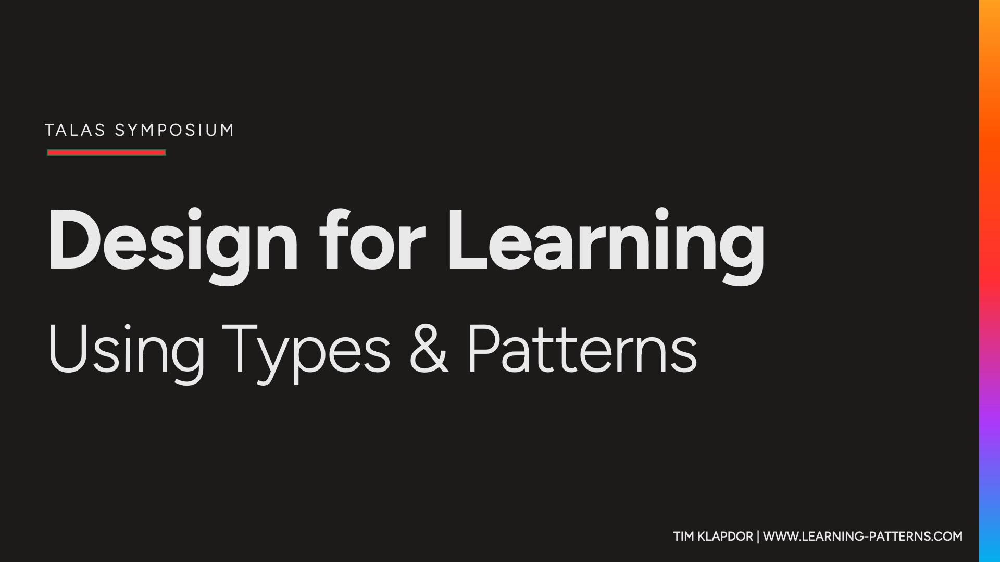
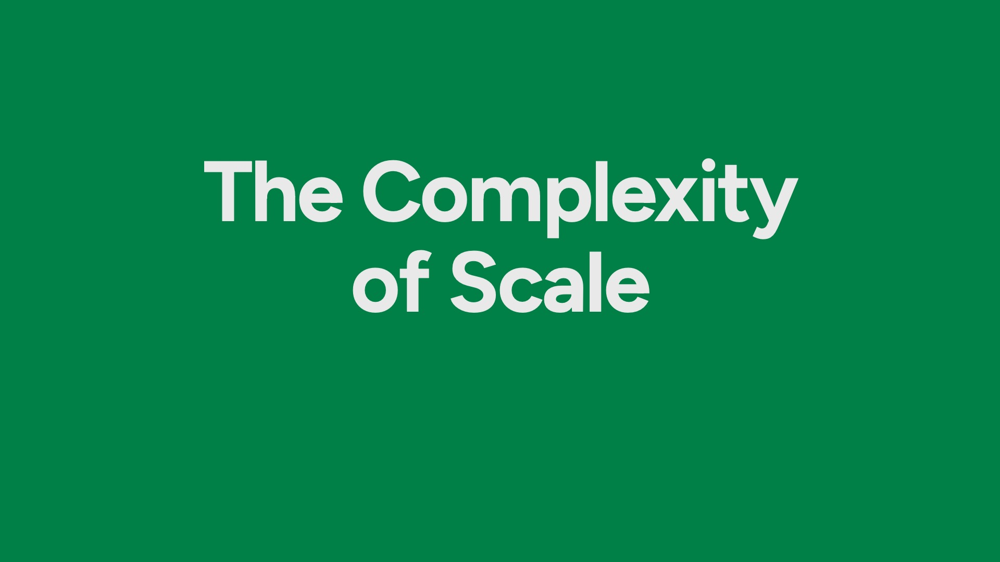
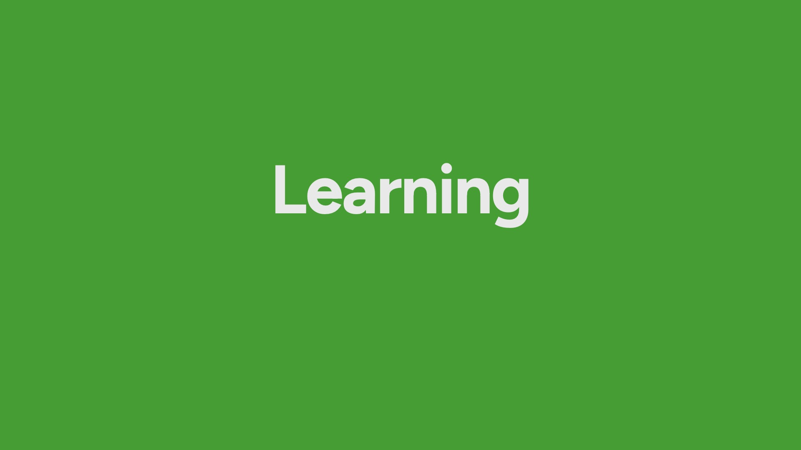

---

title: Design for Learning
date: 2024-07-04
duration: 10 minutes
event: TALAS Symposium
description: > 
    This presetation was developed for the TALAS Symposium, an event that brought together the Learning & Teaching services from University of Adelaide and University of South Australia together to share our ways of working. This presentation kicked off the event and was an attempt to engage with our central purpose - designing for learning. 
slide-folder: 
categories: 
# tags: Learning Design # thematic key words 
updatedDate:
updateDescription: 
coverImage: slide21.jpeg

---

<section>

I put this presentation under the “Navigating complexity” category, but it really does sit across all three. Firstly this presentation is mostly about a small action:
</section>

<section>

It’s about how we can improve the experience of learning by creating and using a shared language.

By providing a common language, we enable our roles and the concepts of learning design to be a discussion – moving from for to with.

But at its heart, it is about navigating the complexities of Learning.

</section>

<section>

On top of those complexities we are adding the task ahead of us - to very quickly and efficiently create a lot of new courses.

</section>

<section>

It's important to come back to the fact that at the end of the day our work centres around learning.

What we do in TALAS is related to it, but it's often in an indirect way.

We help create and build resources for learning, assessments of learning, instructions, and activities that promote learning — but at the end of the day, the act of learning is not in our control.

</section>

<section>

Individual students do the learning. Each person learns in their own way. I found this challenging to get my head around until I was introduced to schema theory - the concept that our brains function as a map of connections. So in that sense we all develop our own schema, linking information with our perceptions, physicality, locations, relationships, sights, smells and sounds.

Learning is then the ability for us to take new information and assimilate it into our existing schema to make connections between things. In order for us to learn, we have to form a connection. Learning is about how we form new connections. How do we connect new concepts, skills, information and knowledge to what we already know?

</section>